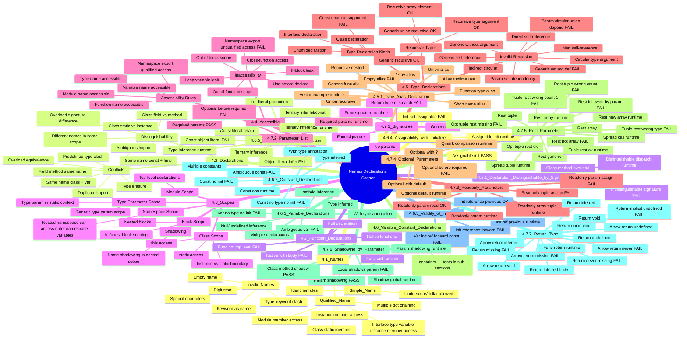

# 04 Names Declarations Scopes - Test Design Mindmap

```mermaid
mindmap
  root((Names Declarations Scopes))
    4.1_Names
      Simple_Name
        Identifier rules
        Underscore/dollar allowed
      Qualified_Name
        Module member access
        Class static member
        Instance member access
        Interface type variable instance member access
        Multiple dot chaining
      Invalid Names
        Empty name
        Digit start
        Keyword as name
        Special characters
        Type keyword clash
    4.2_Declarations
      Distinguishability
        Different names in same scope
        Overload signature difference
        Class static vs instance
        Class field vs method
      Conflicts
        Same name const + func
        Same name class + var
        Field method same name
        Predefined type clash
        Overload equivalence
        Type erasure
        Ambiguous import
        Duplicate import
    4.2.1_Declaration_Distinguishable_by_Signatures
      Class method overload
      Indistinguishable signature FAIL
      Distinguishable dispatch runtime
    4.3_Scopes
      Module Scope
        Top-level declarations
      Class Scope
        this access
        static access
        Instance vs static boundary
      Block Scope
        let/const block scoping
        Nested blocks
      Shadowing
        Name shadowing in nested scope
      Type Parameter Scope
        Generic type param scope
        Type param in static context
      Namespace Scope
        Nested namespace can access outer namespace variables
    4.4_Accessible
      Accessibility Rules
        Type name accessible
        Function name accessible
        Variable name accessible
        Module name accessible
        Namespace export qualified access
      Inaccessibility
        Out of block scope
        Out of function scope
        Use before declare
        Cross-function access
        If-block leak
        Loop variable leak
        Namespace export unqualified access FAIL
    4.5_Type_Declarations
      Type Declaration Kinds
        Class declaration
        Interface declaration
        Enum declaration
        Const enum unsupported FAIL
      Recursive Types
        Recursive array element OK
        Recursive type argument OK
        Generic recursive OK
        Generic union recursive OK
      Invalid Recursion
        Direct self-reference
        Union self-reference
        Circular type argument
        Param self-dependency
        Generic without argument
        Indirect circular
        Generic self-reference
        Generic wo arg def FAIL
        Param circular union depend FAIL
    4.5.1_Type_Alias_Declaration
      Array alias
      Function type alias
      Union alias
      Short name alias
      Generic func alias
      Union recursive
      Recursive nested
      Empty alias FAIL
      Alias runtime use
      Vector example runtime
    4.6_Variable_Constant_Declarations
      (container — tests in sub-sections)
    4.6.1_Variable_Declarations
      With type annotation
      Type inferred
      Multiple declarations
      Lambda inference
      Null/undefined inference
      Var no type no init FAIL
      Ambiguous var FAIL
    4.6.2_Constant_Declarations
      With type annotation
      Type inferred
      Multiple constants
      Const no init FAIL
      Ambiguous const FAIL
      Const no type no init FAIL
      Const ops runtime
    4.6.3_Validity_of_Initializer
      Init reference previous OK
      Init reference forward FAIL
      Var init ref forward const FAIL
      Init ref previous runtime
    4.6.4_Assignability_with_Initializer
      Assignable init PASS
      Init not assignable FAIL
      Assignable init runtime
    4.6.5_Type_Inference_from_Initializer
      Let literal promotion
      Const literal retain
      Ternary infer let/const
      Ternary inference
      Object literal infer FAIL
      Const object literal FAIL
      Type inference runtime
      Ternary inference runtime
    4.7_Function_Declarations
      Full declaration
      Native functions
      Native with body FAIL
      Func not top level FAIL
      Func call runtime
    4.7.1_Signatures
      Generic func
      Func signature
      No params
      Return type mismatch FAIL
      Func signature runtime
    4.7.2_Parameter_List
      Required params PASS
      Optional before required FAIL
      Required params runtime
    4.7.3_Readonly_Parameters
      Readonly param read OK
      Readonly param assign FAIL
      Readonly tuple assign FAIL
      Readonly param runtime
      Readonly array tuple runtime
    4.7.4_Optional_Parameters
      Optional with default
      Optional with ?
      Optional before required FAIL
      Optional default runtime
      Qmark comparison runtime
    4.7.5_Rest_Parameter
      Rest array
      Rest tuple
      Rest generic
      Opt tuple rest ok
      Rest followed by param FAIL
      Rest not array FAIL
      Rest tuple wrong count FAIL
      Opt tuple rest missing FAIL
      Tuple rest wrong count 1 FAIL
      Tuple rest wrong type FAIL
      Spread call runtime
      Rest array runtime
      Rest new array runtime
      Tuple rest ok runtime
      Spread tuple runtime
    4.7.6_Shadowing_by_Parameter
      Param shadowing PASS
      Class method shadow PASS
      Local shadows param FAIL
      Param shadowing runtime
      Shadow global runtime
    4.7.7_Return_Type
      Return inferred body
      Return union void
      Return void
      Return undefined
      Return inferred
      Arrow return undefined
      Arrow return void
      Arrow return inferred
      Return missing FAIL
      Return never missing FAIL
      Return implicit undefined FAIL
      Arrow return missing FAIL
      Arrow return never FAIL
      Func return runtime
```

