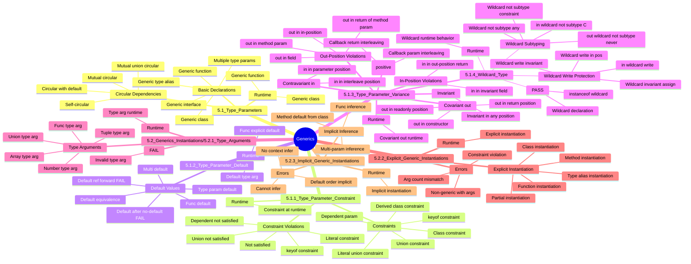

# 05 Generics - Test Design Mindmap

```mermaid
mindmap
  root((Generics))
    5.1_Type_Parameters
      Basic Declarations
        Generic class
        Generic interface
        Generic function
        Generic type alias
        Multiple type params
      Circular Dependencies
        Self-circular
        Mutual circular
        Mutual union circular
        Circular with default
      Runtime
        Generic class
        Generic function
    5.1.1_Type_Parameter_Constraint
      Constraints
        Class constraint
        Union constraint
        Literal union constraint
        keyof constraint
        Dependent param
        Derived class constraint
      Constraint Violations
        Not satisfied
        Union not satisfied
        Literal constraint
        keyof constraint
        Dependent not satisfied
      Runtime
        Constraint at runtime
    5.1.2_Type_Parameter_Default
      Default Values
        Type param default
        Multi default
        Func default
        Default equivalence
        Default after no-default FAIL
        Default ref forward FAIL
      Runtime
        Default type arg
        Func explicit default
    5.1.3_Type_Parameter_Variance
      Covariant out
        out in return position
        out in readonly position
        out in constructor
      Contravariant in
        in in parameter position
        in in interleave position
      Invariant
        Invariant in any position
      Out-Position Violations
        out in in-position
        out in field
        out in method param
        out in return of method param
      In-Position Violations
        in in out-position return
        in in invariant field
      Variance Interleaving (positive)
        Callback param interleaving
        Callback return interleaving
      Runtime
        Covariant out runtime
     5.1.4_Wildcard_Type
      Wildcard Subtyping
        Wildcard not subtype any
        Wildcard not subtype constraint
        out wildcard not subtype never
        in wildcard not subtype C
      Wildcard Write Protection
        Wildcard write in pos
        Wildcard write invariant
        in wildcard write
        Wildcard invariant assign
      PASS
        Wildcard declaration
        instanceof wildcard
      Runtime
        Wildcard runtime behavior
    5.2_Generics_Instantiations/5.2.1_Type_Arguments
      Type Arguments
        Number type arg
        Union type arg
        Array type arg
        Tuple type arg
        Func type arg
      FAIL
        Invalid type arg
      Runtime
        Type arg runtime
    5.2.2_Explicit_Generic_Instantiations
      Explicit Instantiation
        Class instantiation
        Method instantiation
        Function instantiation
        Type alias instantiation
        Partial instantiation
      Errors
        Non-generic with args
        Arg count mismatch
        Constraint violation
      Runtime
        Explicit instantiation
    5.2.3_Implicit_Generic_Instantiations
      Implicit Inference
        Func inference
        Multi-param inference
        Method default from class
      Errors
        Cannot infer
        No context infer
        Default order implicit
      Runtime
        Implicit instantiation
```
